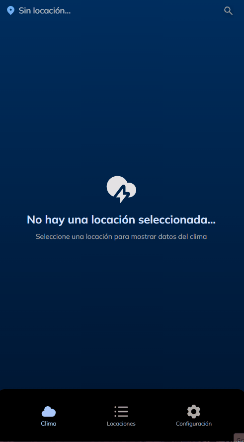
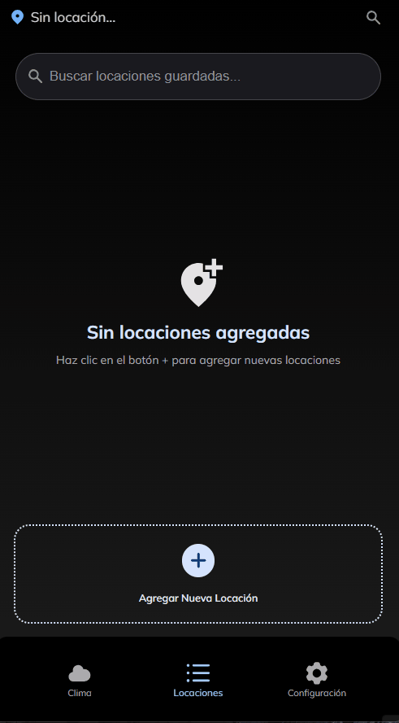
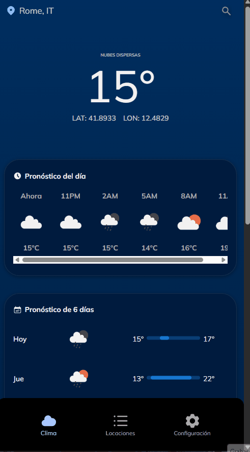

# Lumen Weather

**Lumen Weather** es una app del clima moderna, rápida y visualmente cuidada, creada con **React + TypeScript + Vite**. Permite buscar el pronóstico de cualquier lugar, guardar ubicaciones favoritas y personalizar la forma en que ves la información para adaptarla a tu estilo.

Diseñada con enfoque **mobile first** y experiencia de usuario limpia, Lumen busca hacer que consultar el clima se sienta simple, útil y agradable.

## 🔗 DEMO:

https://lumen-weather.netlify.app/

---

## ✨ Características

- 🔎 Búsqueda de clima por ciudad o ubicación
- 📍 Guardado de ubicaciones favoritas
- 🌡️ Cambio de unidades de temperatura: Celsius / Fahrenheit
- 💨 Unidades personalizables para velocidad del viento
- 🧭 Unidades personalizables para presión atmosférica
- ⏰ Formato de hora configurable: 12h / 24h
- 🌙 Modo claro y modo oscuro
- 📱 Diseño responsive
- ⚡ Interfaz rápida y limpia
- 🎨 Enfoque visual moderno

---

## 🛠️ Tecnologías usadas

- **React**
- **TypeScript**
- **Vite**
- **CSS / Responsive Design**
- **Context API**
- **Fetch API**
- **React Router**
- **Git / GitHub**

---

## 🖼️ Vista de la aplicación

### 🌦️ Información del clima

### 🔍 Búsqueda y guardado de ciudades

### ⚙️ Configuración

---

## 🌐 APIs utilizadas

### OpenWeather

Se utiliza para obtener:

- clima actual
- pronóstico
- temperatura
- humedad
- viento
- presión atmosférica

### Geoapify

Se utiliza para:

- geocodificación
- convertir nombres de lugares en coordenadas
- mejorar la búsqueda de ubicaciones

### Unsplash

Se utiliza para:

- imágenes de fondo
- mejorar la presentación visual
- dar una experiencia más inmersiva según el clima o la ubicación
